---
## Front matter
title: "Отчёт по лабораторной работе 5"
subtitle: "Дисциплина: архитектура компьютера"
author: "Давлетова Мадина"

## Generic otions
lang: ru-RU
toc-title: "Содержание"

## Bibliography
bibliography: bib/cite.bib
csl: pandoc/csl/gost-r-7-0-5-2008-numeric.csl

## Pdf output format
toc: true # Table of contents
toc-depth: 2
lof: true # List of figures
lot: true # List of tables
fontsize: 12pt
linestretch: 1.5
papersize: a4
documentclass: scrreprt
## I18n polyglossia
polyglossia-lang:
  name: russian
  options:
	- spelling=modern
	- babelshorthands=true
polyglossia-otherlangs:
  name: english
## I18n babel
babel-lang: russian
babel-otherlangs: english
## Fonts
mainfont: PT Serif
romanfont: PT Serif
sansfont: PT Sans
monofont: PT Mono
mainfontoptions: Ligatures=TeX
romanfontoptions: Ligatures=TeX
sansfontoptions: Ligatures=TeX,Scale=MatchLowercase
monofontoptions: Scale=MatchLowercase,Scale=0.9
## Biblatex
biblatex: true
biblio-style: "gost-numeric"
biblatexoptions:
  - parentracker=true
  - backend=biber
  - hyperref=auto
  - language=auto
  - autolang=other*
  - citestyle=gost-numeric
## Pandoc-crossref LaTeX customization
figureTitle: "Рис."
tableTitle: "Таблица"
listingTitle: "Листинг"
lofTitle: "Список иллюстраций"
lotTitle: "Список таблиц"
lolTitle: "Листинги"
## Misc options
indent: true
header-includes:
  - \usepackage{indentfirst}
  - \usepackage{float} # keep figures where there are in the text
  - \floatplacement{figure}{H} # keep figures where there are in the text
---

# Цель работы

Целью работы является приобретение практических навыков работы в Midnight Commander. 
Освоение инструкций языка ассемблера mov и int.

# Задание

1. Изучение возможностей Midnight Commander

2. Изучение файла in_out.asm

3. Выполнение заданий, рассмотрение примеров

5. Выполнение заданий для самостоятельной работы

# Теоретическое введение

Midnight Commander (или просто mc) — это программа, которая позволяет просматривать
структуру каталогов и выполнять основные операции по управлению файловой системой,
т.е. mc является файловым менеджером. Midnight Commander позволяет сделать работу с
файлами более удобной и наглядной.

Программа на языке ассемблера NASM, как правило, состоит из трёх секций: секция кода
программы (SECTION .text), секция инициированных (известных во время компиляции)
данных (SECTION .data) и секция неинициализированных данных (тех, под которые во
время компиляции только отводится память, а значение присваивается в ходе выполнения
программы) (SECTION .bss).

# Выполнение лабораторной работы

## Знакомство с Midnight Commander

Я открыла Midnight Commander (рис. [-@fig:001]) и с помощью клавиш со стрелками и Enter перешла в каталог ~/work/arch-pc. 
Затем я нажала F7 и создала каталог lab05 (рис. [-@fig:002]).

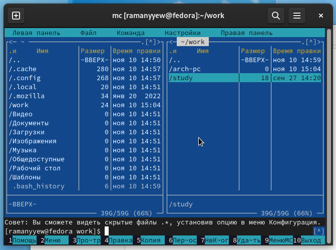{ #fig:001 width=70%, height=70% }

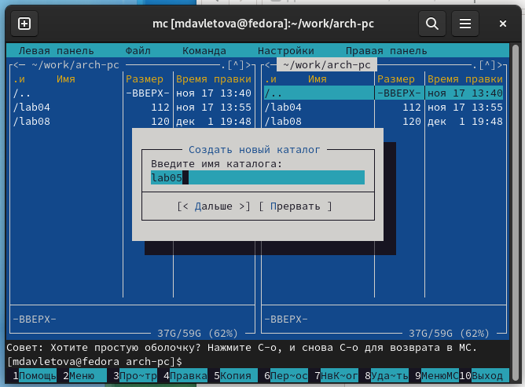{ #fig:002 width=70%, height=70% }

Используя команду touch, я создала файл lab05-1.asm (рис. [-@fig:003]).

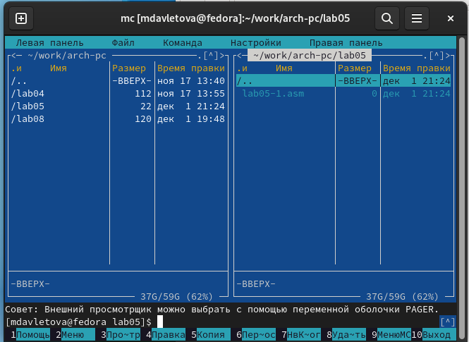{ #fig:003 width=70%, height=70% }

Затем я открыла файл для редактирования, нажав клавишу F4, и выбрала редактор mceditor. 
Написала код программы, соответствующий заданию (рис. [-@fig:004]).

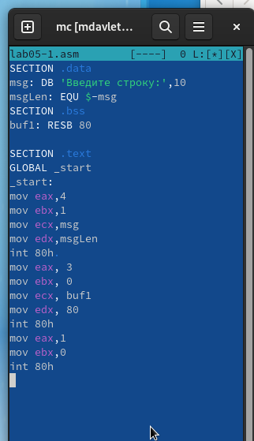{ #fig:004 width=70%, height=70% }

Далее я открыла файл для просмотра, нажав клавишу F3, и убедилась, что он содержит 
написанный код (рис. [-@fig:005]).

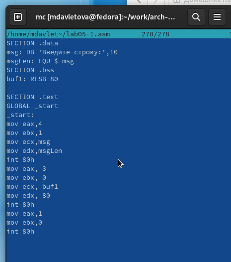{ #fig:005 width=70%, height=70% }

С помощью трансляции файла программы в объектный файл, выполнения компановки объектного файла 
и получения исполняемого файла, я проверила работу программы (рис. [-@fig:006]). 

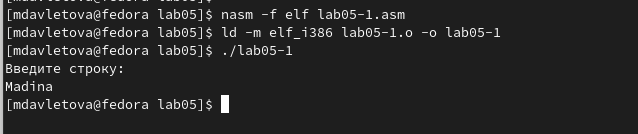{ #fig:006 width=70%, height=70% }

## Подключение внешнего файла in_out.asm

Я скачала файл in_out.asm (рис. [-@fig:007]) 
и разместила его в рабочем каталоге.

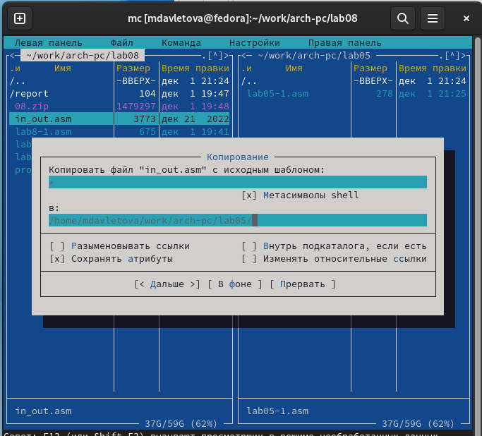{ #fig:007 width=70%, height=70% }

С помощью клавиши F5 скопировала содержимое файла lab05-1.asm в файл lab05-2.asm (рис. [-@fig:008])

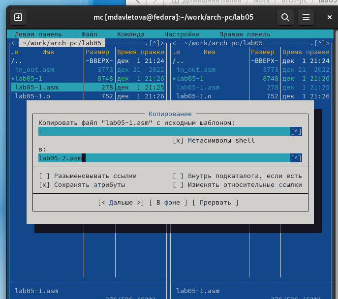{ #fig:008 width=70%, height=70% }

Затем я написала код программы lab05-2.asm, используя подпрограммы из внешнего файла in_out.asm (рис. [-@fig:009]).

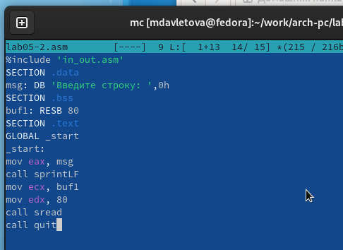{ #fig:009 width=70%, height=70% }

Скомпилировала программу и проверила её запуск (рис. [-@fig:010])

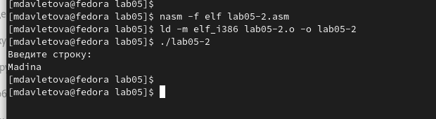{ #fig:010 width=70%, height=70% }

В файле lab05-2.asm заменила вызов подпрограммы sprintLF на sprint (рис. [-@fig:011]). 
Я пересобрала исполняемый файл (рис. [-@fig:012]). 
Теперь после вывода строки символ перехода на новую строку отсутствует.

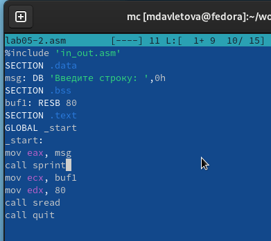{ #fig:011 width=70%, height=70% }

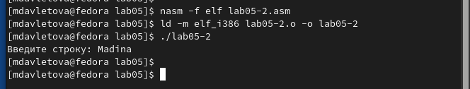{ #fig:012 width=70%, height=70% }

## Выполнение заданий для самостоятельной работы

Я скопировала программу lab05-1.asm и внесла изменения в код, 
чтобы программа работала по следующему алгоритму: 
она выводит приглашение вида "Введите строку:", 
считывает строку с клавиатуры и выводит введенную строку на экран. 
(рис. [-@fig:013]) (рис. [-@fig:014])

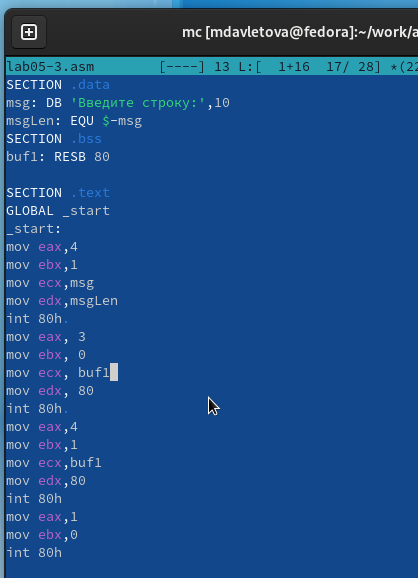{ #fig:013 width=70%, height=70% }

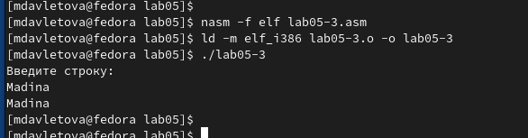{ #fig:014 width=70%, height=70% }

Аналогично я скопировала программу lab05-2.asm и изменила код, но теперь использовала 
подпрограммы из файла in_out.asm. (рис. [-@fig:015]) (рис. [-@fig:016])

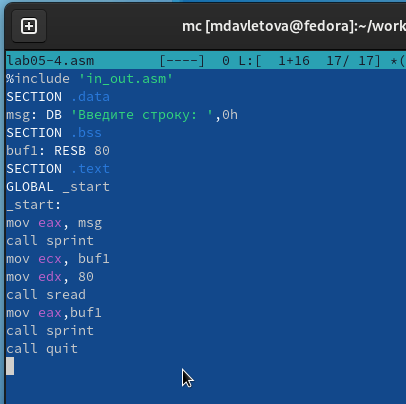{ #fig:015 width=70%, height=70% }

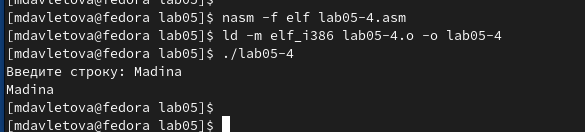{ #fig:016 width=70%, height=70% }

# Выводы

Научились писать базовые ассемблерные программы. Освоили ассемблерные инструкции mov и int.
